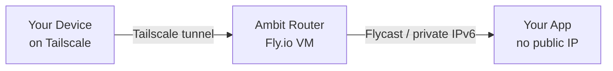

# Ambit CLI

## What Ambit Is

Ambit deploys apps to the cloud in a way that makes them completely unreachable from the public internet. Only devices enrolled in the user's private Tailscale network can connect to them. From the outside world's perspective, the app does not exist — there is no IP address to find, no port to scan.

This matters because putting a database, dashboard, or internal tool on the normal internet forces you to build login pages, configure firewalls, and harden the app against strangers. Ambit skips all of that. Access control is handled at the network level: if a device is on the Tailscale network, it can reach the app; if it isn't, the connection is refused before the app ever sees it.

Each private network you create is called an **ambit**. Every app deployed to it gets a human-readable address under that network's name — so `http://my-app.lab` means the `my-app` application on the `lab` ambit. These addresses work automatically for any device enrolled in the user's Tailscale account.

## Installation

Run directly via npx — no global install needed:

```bash
npx @cardelli/ambit
```

## How It Works



Ambit creates a router on Fly.io that joins the user's Tailscale network and advertises the private IPv6 subnet for that ambit. It also sets up split DNS so that `*.<network>` queries resolve to the right app. Apps deployed with `ambit deploy` get a private Flycast address on the network and never receive a public IP.

## Security Model

The router never receives the user's Tailscale API token. During `ambit create`, the CLI mints a single-use, tag-scoped auth key (5-minute expiry) and passes only that to the router. The auth key is consumed on first boot and is worthless afterwards. Route approval is handled by the CLI, not the router.

## Prerequisites

- `flyctl` installed and authenticated (`fly auth login`)
- Tailscale installed and connected (`tailscale up`)
- Accept-routes enabled (`sudo tailscale set --accept-routes`)
- A Tailscale API access token (`tskey-api-...`) — create one at https://login.tailscale.com/admin/settings/keys

## Commands

### `npx @cardelli/ambit create <network>`

Creates a new private network. This is the first command to run when setting up a new ambit. It deploys a router on Fly.io, connects it to the user's Tailscale network, and configures split DNS so apps on the network are reachable by name.

```bash
npx @cardelli/ambit create lab
npx @cardelli/ambit create lab --org my-org --region sea
npx @cardelli/ambit create lab --no-auto-approve
```

**Flags:**
- `--org <org>` — Fly.io organization slug
- `--region <region>` — Fly.io region (default: `iad`)
- `--api-key <key>` — Tailscale API access token (prompted interactively if omitted)
- `--tag <tag>` — Tailscale ACL tag for the router (default: `tag:ambit-<network>`)
- `--no-auto-approve` — Skip waiting for router and approving routes (deploy only, configure later)
- `-y, --yes` — Skip confirmation prompts
- `--json` — Output as JSON (implies `--no-auto-approve`)

**What it does:**
1. Validates Fly.io auth and the Tailscale API key
2. Checks that the tag (default `tag:ambit-<network>`, or custom via `--tag`) exists in Tailscale ACL tagOwners
3. Checks for duplicate routers on the same network
4. Creates a Fly.io app on the custom network
5. Mints a single-use, tag-scoped Tailscale auth key (never sends the API token to the router)
6. Sets secrets: `TAILSCALE_AUTHKEY`, `NETWORK_NAME`, `ROUTER_ID`
7. Deploys the router container
8. Waits for the device to join the tailnet and discovers the real subnet (e.g. `fdaa:4a:d38b::/48`)
9. Approves subnet routes via API if autoApprovers is not configured in ACL
10. Configures split DNS (`*.<network>` → router)
11. Enables accept-routes locally if possible

Steps 8–11 are skipped when `--no-auto-approve` or `--json` is used.

**Before running**, the user must add the router's tag to their Tailscale ACL tagOwners. They can do this in two ways:

1. **Visual editor** (recommended): Go to https://login.tailscale.com/admin/acls/visual/tags, click "Add tag", and add `tag:ambit-<network>` with `autogroup:admin` as the owner.

2. **ACL file**: Go to https://login.tailscale.com/admin/acls/file and add to tagOwners:
```json
"tagOwners": { "tag:ambit-<network>": ["autogroup:admin"] }
```

**After the router is deployed**, the CLI prints recommended ACL configuration including the real subnet. You MUST surface this output to the user — it contains the actual subnet needed for ACL rules. The user can apply these settings either through:

- **Visual editor**: https://login.tailscale.com/admin/acls/visual — navigate to Auto Approvers or Access Rules sections
- **ACL file**: https://login.tailscale.com/admin/acls/file — paste the JSON from the terminal output

Example terminal output to surface:
```json
"autoApprovers": { "routes": { "fdaa:4a:d38b::/48": ["tag:ambit-<network>"] } }
```
```json
{"action": "accept", "src": ["group:YOUR_GROUP"], "dst": ["tag:ambit-<network>:53"]}
{"action": "accept", "src": ["group:YOUR_GROUP"], "dst": ["fdaa:4a:d38b::/48:*"]}
```

### `npx @cardelli/ambit deploy <app>.<network>`

Deploys an app onto a private network. The network can be specified as part of the name (`my-app.lab`) or with `--network` (`my-app --network lab`). This is the safe alternative to `fly deploy`: it always passes `--no-public-ips` and `--flycast`, runs pre-flight checks on the fly.toml for dangerous settings, and audits the result to verify no public IPs were allocated.

The actual Fly.io app name is suffixed with the router's ID (e.g. `my-app-2obeh25b`) to avoid collisions across networks. This is transparent — you always refer to the app as `my-app.lab` and DNS resolves it automatically.

There are three mutually exclusive deployment modes:

**Config mode** (default) — uses a local `fly.toml`:
```bash
npx @cardelli/ambit deploy my-app.lab
npx @cardelli/ambit deploy my-app.lab --config ./custom.toml
```

**Image mode** — deploys a Docker image without fly.toml:
```bash
npx @cardelli/ambit deploy my-app.lab --image registry.fly.io/my-app:latest
npx @cardelli/ambit deploy my-app.lab --image registry.fly.io/my-app:latest --main-port 3000
```

**Template mode** — fetches a template from a GitHub repository and deploys it:
```bash
npx @cardelli/ambit deploy my-browser.lab --template ToxicPine/ambit-templates/chromatic
npx @cardelli/ambit deploy my-browser.lab --template ToxicPine/ambit-templates/chromatic@v1.0
npx @cardelli/ambit deploy my-shell.lab --template ToxicPine/ambit-templates/wetty
```

**Flags:**
- `--network <name>` — Target network (alternative to the `app.network` shorthand)
- `--org <org>` — Fly.io organization
- `--region <region>` — Primary region
- `--config <path>` — Explicit path to fly.toml (config mode)
- `--image ` — Docker image to deploy (image mode)
- `--main-port <port>` — Internal port for HTTP service in image mode (default: 80, "none" to skip)
- `--template <ref>` — GitHub template reference (template mode)
- `-y, --yes` — Skip confirmation
- `--json` — Output as JSON

**Template reference format:**
```
owner/repo                  Fetch repo root from the default branch
owner/repo/path             Fetch subdirectory from the default branch
owner/repo/path@tag         Fetch a tagged release
owner/repo/path@branch      Fetch a specific branch
owner/repo/path@commit      Fetch a specific commit
```

The template must contain a `fly.toml` (and typically a Dockerfile or a pre-built image reference). The template is fetched from GitHub's tarball API, extracted, pre-flight scanned, and deployed. The temp directory is cleaned up automatically.

### `npx @cardelli/ambit list`

Lists all discovered routers across all networks.

```bash
npx @cardelli/ambit list
npx @cardelli/ambit list --org my-org --json
```

Shows: network name, app name, region, machine state, private IP, subnet, and Tailscale device status.

### `npx @cardelli/ambit status`

Shows detailed router status. Run without `--network` to see all routers, or with `--network` to focus on one.

```bash
npx @cardelli/ambit status
npx @cardelli/ambit status --network lab
```

Detailed view includes: machine state, SOCKS5 proxy address, Tailscale IP, online status, advertised routes, and split DNS config.

### `npx @cardelli/ambit destroy network <name>` / `npx @cardelli/ambit destroy app <app>.<network>`

Destroys either a network (router) or a workload app.

**Destroy a network** — tears down the router and cleans up all associated resources. Apps deployed on the network are NOT deleted — only the router is removed.

```bash
npx @cardelli/ambit destroy network lab
npx @cardelli/ambit destroy network lab --yes
```

**What it does:**
1. Finds the router app for the network
2. Clears split DNS configuration
3. Removes the Tailscale device
4. Destroys the Fly.io app

After destroying a network, the user should clean up their Tailscale ACL policy. Tell them they can either:
- **Visual editor**: Go to https://login.tailscale.com/admin/acls/visual and remove the tag from Tags, Auto Approvers, and Access Rules sections
- **ACL file**: Go to https://login.tailscale.com/admin/acls/file and remove `tag:ambit-<network>` from `tagOwners`, `autoApprovers`, and `acls`

**Destroy an app** — removes a workload app from a network.

```bash
npx @cardelli/ambit destroy app my-app.lab
npx @cardelli/ambit destroy app my-app --network lab
npx @cardelli/ambit destroy app my-app.lab --yes
```

### `npx @cardelli/ambit doctor`

Health check for the local environment and router infrastructure. Run this whenever something seems wrong — it checks the most common failure points and gives remediation hints.

```bash
npx @cardelli/ambit doctor
npx @cardelli/ambit doctor --network lab
```

**Checks:**
- Tailscale CLI installed
- Tailscale connected (BackendState = Running)
- Accept-routes enabled
- Router(s) exist and machines are running
- Router(s) visible in tailnet

## Templates

Ready-to-deploy templates are available at `ToxicPine/ambit-templates`:

| Template | Description |
|----------|-------------|
| `ToxicPine/ambit-templates/chromatic` | Headless Chrome exposing Chrome DevTools Protocol on port 9222 — for AI agents or scripts that need a browser on the private network. |
| `ToxicPine/ambit-templates/wetty` | A cloud devshell with a web terminal, persistent home directory, passwordless sudo, and auto start/stop. |
| `ToxicPine/ambit-templates/opencode` | A private OpenCode web workspace — Nix-based environment with persistent home and auto start/stop. |
| `ToxicPine/ambit-openclaw` | A self-hosted OpenClaw instance — a personal AI assistant you can talk to from WhatsApp, Telegram, Discord, and other chat apps. |

```bash
npx @cardelli/ambit deploy my-browser.lab --template ToxicPine/ambit-templates/chromatic
npx @cardelli/ambit deploy my-shell.lab --template ToxicPine/ambit-templates/wetty
npx @cardelli/ambit deploy my-code.lab --template ToxicPine/ambit-templates/opencode
npx @cardelli/ambit deploy my-gateway.lab --template ToxicPine/ambit-openclaw
```

## Common Workflows

### First-Time Setup
```bash
# 1. Add tag to Tailscale ACL:
#    Visual editor: https://login.tailscale.com/admin/acls/visual/tags
#    Or ACL file:   https://login.tailscale.com/admin/acls/file

# 2. Create the router
npx @cardelli/ambit create lab

# 3. IMPORTANT: Read the terminal output — it prints recommended ACL rules
#    with the real subnet. Surface these to the user so they can configure
#    autoApprovers and access rules.

# 4. Deploy an app
npx @cardelli/ambit deploy my-app.lab

# 5. App is now reachable as http://my-app.lab from any device on the tailnet

# 6. To control access, the user can:
#    - Invite people: https://login.tailscale.com/admin/users
#    - Set access rules: https://login.tailscale.com/admin/acls/visual/general-access-rules
```

### Deploy from a Template
```bash
npx @cardelli/ambit deploy my-browser.lab --template ToxicPine/ambit-templates/chromatic
# → headless Chrome at my-browser.lab:9222, reachable via CDP
```

### Debugging Connectivity
```bash
npx @cardelli/ambit doctor --network lab    # Check all the common failure points
npx @cardelli/ambit status --network lab    # Detailed router state
```

### Tearing Down
```bash
npx @cardelli/ambit destroy app my-app.lab        # Remove an app
npx @cardelli/ambit destroy network lab           # Remove the whole network
# Then clean up Tailscale ACL:
#   Visual editor: https://login.tailscale.com/admin/acls/visual
#   Or ACL file:   remove tag:ambit-lab from tagOwners, autoApprovers, acls
```

## ACL Configuration Guide

When `ambit create` or `ambit destroy` requires ACL changes, always tell the user they have two options:

1. **Visual editor** (easier for most users): Direct them to the relevant section at https://login.tailscale.com/admin/acls/visual — Tags, Auto Approvers, or Access Rules.

2. **ACL file** (for users who prefer code): Direct them to https://login.tailscale.com/admin/acls/file and provide the exact JSON from the terminal output.

Always surface the terminal output from `ambit create` that contains the real subnet and recommended rules — the user needs this information to configure their ACL correctly.

## Troubleshooting

| Symptom | Fix |
|---------|-----|
| "Tag not configured in tagOwners" | Add `tag:ambit-<network>` in the visual editor at https://login.tailscale.com/admin/acls/visual/tags, or add `"tag:ambit-<network>": ["autogroup:admin"]` to tagOwners in the ACL file. |
| Router deployed but not reachable | Run `npx @cardelli/ambit doctor`. Check that accept-routes is enabled locally. |
| "Timeout waiting for device" | Check router logs. Most common cause: expired or invalid Tailscale API key. |
| Apps not resolving as `<app>.<network>` | Verify split DNS is configured: `npx @cardelli/ambit status --network <name>`. Check the router is online in the tailnet. |
| "Flyctl not found" | Install from https://fly.io/docs/flyctl/install/ |
