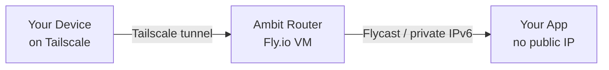

# Ambit CLI

## What Ambit Is

Ambit deploys apps to the cloud in a way that makes them completely unreachable from the public internet. Only devices enrolled in the user's private Tailscale network can connect to them. From the outside world's perspective, the app does not exist — there is no IP address to find, no port to scan.

This matters because putting a database, dashboard, or internal tool on the normal internet forces you to build login pages, configure firewalls, and harden the app against strangers. Ambit skips all of that. Access control is handled at the network level: if a device is on the Tailscale network, it can reach the app; if it isn't, the connection is refused before the app ever sees it.

Each private network you create is called an **ambit**. Every app deployed to it gets a human-readable address under that network's name — so `http://my-app.lab` means the `my-app` application on the `lab` ambit. These addresses work automatically for any device enrolled in the user's Tailscale account.

## Installation

Run directly via npx — no global install needed:

```bash
npx @cardelli/ambit
```

## How It Works



Ambit creates a router on Fly.io that joins the user's Tailscale network and advertises the private IPv6 subnet for that ambit. It also sets up split DNS so that `*.<network>` queries resolve to the right app. Apps deployed with `ambit deploy` get a private Flycast address on the network and never receive a public IP.

## Security Model

The router never receives the user's Tailscale API token. During `ambit create`, the CLI mints a single-use, tag-scoped auth key (5-minute expiry) and passes only that to the router. The auth key is consumed on first boot and is worthless afterwards. Route approval is handled by the CLI, not the router.

## Prerequisites

- `flyctl` installed and authenticated (`fly auth login`)
- Tailscale installed and connected (`tailscale up`)
- Accept-routes enabled (`sudo tailscale set --accept-routes`)
- A Tailscale API access token (`tskey-api-...`) — create one at https://login.tailscale.com/admin/settings/keys

## Commands

### `npx @cardelli/ambit create <network>`

Creates a new private network. This is the first command to run when setting up a new ambit. It deploys a router on Fly.io, connects it to the user's Tailscale network, and configures split DNS so apps on the network are reachable by name.

```bash
npx @cardelli/ambit create lab
npx @cardelli/ambit create lab --org my-org --region sea
npx @cardelli/ambit create lab --no-auto-approve
```

**Flags:**
- `--org <org>` — Fly.io organization slug
- `--region <region>` — Fly.io region (default: `iad`)
- `--api-key <key>` — Tailscale API access token (prompted interactively if omitted)
- `--tag <tag>` — Tailscale ACL tag for the router (default: `tag:ambit-<network>`)
- `--manual` — Skip automatic Tailscale ACL configuration (tagOwners + autoApprovers)
- `--no-auto-approve` — Skip waiting for router and approving routes (deploy only, configure later)
- `-y, --yes` — Skip confirmation prompts
- `--json` — Output as JSON (implies `--no-auto-approve`)

**What it does:**
1. Validates Fly.io auth and the Tailscale API key
2. Auto-configures ACL: adds the tag to `tagOwners` and `autoApprovers` in the Tailscale policy (skipped with `--manual`)
3. Checks for duplicate routers on the same network
4. Creates a Fly.io app on the custom network
5. Mints a single-use, tag-scoped Tailscale auth key (never sends the API token to the router)
6. Sets secrets: `TAILSCALE_AUTHKEY`, `NETWORK_NAME`, `ROUTER_ID`
7. Deploys the router container
8. Waits for the device to join the tailnet and discovers the real subnet (e.g. `fdaa:4a:d38b::/48`)
9. Approves subnet routes via API if autoApprovers is not configured in ACL
10. Configures split DNS (`*.<network>` → router)
11. Enables accept-routes locally if possible

Steps 8–11 are skipped when `--no-auto-approve` or `--json` is used.

**ACL auto-configuration:** By default, ambit patches the Tailscale policy to add `tagOwners` and `autoApprovers` entries for the router's tag. This requires an API token with ACL write permission (`policy_file` scope). If the token lacks that permission (HTTP 403), ambit will fail and instruct the user to re-run with `--manual`. With `--manual`, the user must configure the policy themselves before the router can join the tailnet:

1. **Visual editor** (recommended): Go to https://login.tailscale.com/admin/acls/visual/tags, click "Add tag", and add `tag:ambit-<network>` with `autogroup:admin` as the owner.

2. **ACL file**: Go to https://login.tailscale.com/admin/acls/file and add to tagOwners:
```json
"tagOwners": { "tag:ambit-<network>": ["autogroup:admin"] }
```

**After the router is deployed**, the CLI prints recommended ACL rules including the real subnet. Surface this output to the user — it contains the subnet needed for `acls` access rules (which ambit never configures automatically):

```json
{"action": "accept", "src": ["group:YOUR_GROUP"], "dst": ["tag:ambit-<network>:53"]}
{"action": "accept", "src": ["group:YOUR_GROUP"], "dst": ["fdaa:4a:d38b::/48:*"]}
```

### `npx @cardelli/ambit share <network> <member> [<member>...]`

Grants one or more members access to a network by adding two accept rules per member to the `acls` section of the Tailscale policy:

1. **DNS rule**: `<member> → <tag>:53` — lets the member resolve `*.<network>` names
2. **Subnet rule**: `<member> → <subnet>:*` — lets the member reach all apps on the network

Each member must be one of: a `group:<name>` string, a `tag:<name>` string, an `autogroup:<name>` string, or a valid email address. All members are Zod-validated before any API calls are made.

```bash
npx @cardelli/ambit share browsers group:team
npx @cardelli/ambit share browsers group:team alice@example.com group:contractors
npx @cardelli/ambit share browsers group:team --org my-org
```

**Flags:**
- `--org <org>` — Fly.io organization slug
- `--json` — Output as JSON

**What it does:**
1. Validates all members (fails with clear errors before touching the API)
2. Discovers the router for the network (dies if not found)
3. Gets the subnet from the router's machine
4. Gets the tag from the router's Tailscale device (falls back to `tag:ambit-<network>`)
5. Reads the current ACL policy
6. Idempotently adds DNS and subnet accept rules for each member
7. Runs a sanity check (`assertAdditivePatch`) to verify no existing data was accidentally removed
8. Validates the updated policy against the Tailscale API before writing
9. Pushes the updated policy in a single call

The command is idempotent — re-running it when rules already exist is safe (no duplicates). Requires a Tailscale API token with ACL write permission (`policy_file` scope). Fails with a clear error on 403.

### `npx @cardelli/ambit deploy <app>.<network>`

Deploys an app onto a private network. The network can be specified as part of the name (`my-app.lab`) or with `--network` (`my-app --network lab`). This is the safe alternative to `fly deploy`: it always passes `--no-public-ips` and `--flycast`, runs pre-flight checks on the fly.toml for dangerous settings, and audits the result to verify no public IPs were allocated.

The actual Fly.io app name is suffixed with the router's ID (e.g. `my-app-2obeh25b`) to avoid collisions across networks. This is transparent — you always refer to the app as `my-app.lab` and DNS resolves it automatically.

There are three mutually exclusive deployment modes:

**Config mode** (default) — uses a local `fly.toml`:
```bash
npx @cardelli/ambit deploy my-app.lab
npx @cardelli/ambit deploy my-app.lab --config ./custom.toml
```

**Image mode** — deploys a Docker image without fly.toml:
```bash
npx @cardelli/ambit deploy my-app.lab --image registry.fly.io/my-app:latest
npx @cardelli/ambit deploy my-app.lab --image registry.fly.io/my-app:latest --main-port 3000
```

**Template mode** — fetches a template from a GitHub repository and deploys it:
```bash
npx @cardelli/ambit deploy my-browser.lab --template ToxicPine/ambit-templates/chromatic
npx @cardelli/ambit deploy my-browser.lab --template ToxicPine/ambit-templates/chromatic@v1.0
npx @cardelli/ambit deploy my-shell.lab --template ToxicPine/ambit-templates/wetty
```

**Flags:**
- `--network <name>` — Target network (alternative to the `app.network` shorthand)
- `--org <org>` — Fly.io organization
- `--region <region>` — Primary region
- `--config <path>` — Explicit path to fly.toml (config mode)
- `--image ` — Docker image to deploy (image mode)
- `--main-port <port>` — Internal port for HTTP service in image mode (default: 80, "none" to skip)
- `--template <ref>` — GitHub template reference (template mode)
- `-y, --yes` — Skip confirmation
- `--json` — Output as JSON

**Template reference format:**
```
owner/repo                  Fetch repo root from the default branch
owner/repo/path             Fetch subdirectory from the default branch
owner/repo/path@tag         Fetch a tagged release
owner/repo/path@branch      Fetch a specific branch
owner/repo/path@commit      Fetch a specific commit
```

The template must contain a `fly.toml` (and typically a Dockerfile or a pre-built image reference). The template is fetched from GitHub's tarball API, extracted, pre-flight scanned, and deployed. The temp directory is cleaned up automatically.

### `npx @cardelli/ambit list`

Lists all discovered routers across all networks.

```bash
npx @cardelli/ambit list
npx @cardelli/ambit list --org my-org --json
```

Shows: network name, app name, region, machine state, private IP, subnet, and Tailscale device status.

### `npx @cardelli/ambit status`

Shows router and app status. Without a subcommand, defaults to showing all routers (same as `status network`).

```bash
npx @cardelli/ambit status                          # Summary of all routers
npx @cardelli/ambit status network lab              # Detailed view of one network
npx @cardelli/ambit status app my-app.lab           # Detailed view of one app
npx @cardelli/ambit status app my-app.lab --json    # JSON output
```

Network detail includes: machine state, SOCKS5 proxy address, Tailscale IP, subnet, and apps on the network. App detail includes: machines, Flycast IPs, and router status.

### `npx @cardelli/ambit destroy network <name>` / `npx @cardelli/ambit destroy app <app>.<network>`

Destroys either a network (router) or a workload app.

**Destroy a network** — tears down the router and cleans up all associated resources. Apps deployed on the network are NOT deleted — only the router is removed.

```bash
npx @cardelli/ambit destroy network lab
npx @cardelli/ambit destroy network lab --yes
npx @cardelli/ambit destroy network lab --manual   # skip ACL cleanup
```

**What it does:**
1. Finds the router app for the network
2. Clears split DNS configuration
3. Removes the Tailscale device
4. Destroys the Fly.io app
5. Auto-cleans ACL: removes the tag from `tagOwners` and `autoApprovers` in the Tailscale policy (skipped with `--manual`)

`--manual` skips the ACL cleanup step (step 5). Use it when the API token lacks ACL write permission, or when the user manages the policy themselves. If ACL cleanup fails with a 403, ambit warns and suggests re-running with `--manual`.

After destroying, the user still needs to manually remove any `acls` rules referencing the tag (ambit never touches `acls` entries automatically). Tell them they can do this either:
- **Visual editor**: Go to https://login.tailscale.com/admin/acls/visual and remove rules from the Access Rules section
- **ACL file**: Go to https://login.tailscale.com/admin/acls/file and remove entries referencing `tag:ambit-<network>` from `acls`

**Destroy an app** — removes a workload app from a network.

```bash
npx @cardelli/ambit destroy app my-app.lab
npx @cardelli/ambit destroy app my-app --network lab
npx @cardelli/ambit destroy app my-app.lab --yes
```

### `npx @cardelli/ambit doctor`

Health check for the local environment and router infrastructure. Run this whenever something seems wrong — it checks the most common failure points and gives remediation hints. Without a subcommand, defaults to checking all routers (same as `doctor network`).

```bash
npx @cardelli/ambit doctor                          # Check all routers
npx @cardelli/ambit doctor network lab              # Check one network
npx @cardelli/ambit doctor app my-app.lab           # Check one app + its router
npx @cardelli/ambit doctor app my-app.lab --json    # JSON output
```

**Checks:**
- Tailscale CLI installed
- Tailscale connected (BackendState = Running)
- Accept-routes enabled
- Router(s) exist and machines are running
- Router(s) visible in tailnet
- Subnet routes approved (auto-approves unapproved routes)

## Templates

Ready-to-deploy templates are available at `ToxicPine/ambit-templates`:

| Template | Description |
|----------|-------------|
| `ToxicPine/ambit-templates/chromatic` | Headless Chrome exposing Chrome DevTools Protocol on port 9222 — for AI agents or scripts that need a browser on the private network. |
| `ToxicPine/ambit-templates/wetty` | A cloud devshell with a web terminal, persistent home directory, passwordless sudo, and auto start/stop. |
| `ToxicPine/ambit-templates/opencode` | A private OpenCode web workspace — Nix-based environment with persistent home and auto start/stop. |
| `ToxicPine/ambit-openclaw` | A self-hosted OpenClaw instance — a personal AI assistant you can talk to from WhatsApp, Telegram, Discord, and other chat apps. |

```bash
npx @cardelli/ambit deploy my-browser.lab --template ToxicPine/ambit-templates/chromatic
npx @cardelli/ambit deploy my-shell.lab --template ToxicPine/ambit-templates/wetty
npx @cardelli/ambit deploy my-code.lab --template ToxicPine/ambit-templates/opencode
npx @cardelli/ambit deploy my-gateway.lab --template ToxicPine/ambit-openclaw
```

## Common Workflows

### First-Time Setup
```bash
# 1. Create the router — ambit auto-configures ACL (tagOwners + autoApprovers)
npx @cardelli/ambit create lab

# 2. IMPORTANT: Read the terminal output — it prints recommended acls rules
#    with the real subnet. Surface these to the user so they can restrict
#    who on their tailnet can reach this network (ambit never writes acls rules).

# 3. Deploy an app
npx @cardelli/ambit deploy my-app.lab

# 4. App is now reachable as http://my-app.lab from any device on the tailnet

# 5. Share the network with a group (adds acls rules automatically):
npx @cardelli/ambit share lab group:team

# 6. To fine-tune access further:
#    - Invite people: https://login.tailscale.com/admin/users
#    - Edit access rules: https://login.tailscale.com/admin/acls/visual/general-access-rules

# If the API token lacks ACL write permission, use --manual and configure ACL manually first:
# npx @cardelli/ambit create lab --manual
```

### Sharing a Network with a Team
```bash
npx @cardelli/ambit share browsers group:team                          # single group
npx @cardelli/ambit share browsers group:team alice@example.com        # group + user
npx @cardelli/ambit share browsers group:team group:contractors        # multiple groups
# Adds two acls rules per member: DNS (tag:53) + subnet (*:*)
# All members validated (group:*, tag:*, autogroup:*, or email) before any API call
# Idempotent — safe to re-run
```

### Deploy from a Template
```bash
npx @cardelli/ambit deploy my-browser.lab --template ToxicPine/ambit-templates/chromatic
# → headless Chrome at my-browser.lab:9222, reachable via CDP
```

### Debugging Connectivity
```bash
npx @cardelli/ambit doctor network lab      # Check all the common failure points
npx @cardelli/ambit status network lab      # Detailed router state
npx @cardelli/ambit status app my-app.lab   # Check a specific app
```

### Tearing Down
```bash
npx @cardelli/ambit destroy app my-app.lab        # Remove an app
npx @cardelli/ambit destroy network lab           # Remove the whole network
# ambit auto-removes tag:ambit-lab from tagOwners and autoApprovers in the ACL

# The user still needs to manually remove any acls rules referencing the tag:
#   Visual editor: https://login.tailscale.com/admin/acls/visual (Access Rules section)
#   Or ACL file:   remove entries referencing tag:ambit-lab from acls

# If the API token lacks ACL write permission, use --manual to skip ACL cleanup:
# npx @cardelli/ambit destroy network lab --manual
```

## ACL Configuration Guide

Ambit automatically manages `tagOwners` and `autoApprovers` in the Tailscale policy by default. It never touches `acls` (access rules) — those are user-authored and must be configured manually.

**What ambit manages automatically (default):**
- `tagOwners`: adds/removes the router tag on `create`/`destroy network`
- `autoApprovers.routes`: adds/removes the subnet route on `create`/`destroy network`

**What `ambit share` configures:**
- `acls`: adds accept rules for a group → tag:53 and group → subnet:* (DNS + data access)

**What the user must configure manually (when not using `ambit share`):**
- `acls`: custom rules restricting which users/devices can reach the network (ambit prints the recommended format after `create`)

When `ambit create` or `ambit destroy` fails with an ACL permission error, tell the user to re-run with `--manual` and then configure the policy themselves. They have two options:

1. **Visual editor** (easier for most users): Direct them to the relevant section at https://login.tailscale.com/admin/acls/visual — Tags, Auto Approvers, or Access Rules.

2. **ACL file** (for users who prefer code): Direct them to https://login.tailscale.com/admin/acls/file and provide the exact JSON from the terminal output.

Always surface the terminal output from `ambit create` that contains the real subnet and recommended `acls` rules — the user needs this to restrict access to the network.

## Troubleshooting

| Symptom | Fix |
|---------|-----|
| "ACL write permission denied" / HTTP 403 | The API token lacks `policy_file` write scope. For `create`/`destroy network` re-run with `--manual`. For `share`, use a token with `policy_file` scope. |
| "Tag not configured in tagOwners" (with `--manual`) | Add `tag:ambit-<network>` in the visual editor at https://login.tailscale.com/admin/acls/visual/tags, or add `"tag:ambit-<network>": ["autogroup:admin"]` to tagOwners in the ACL file. |
| Router deployed but not reachable | Run `npx @cardelli/ambit doctor`. Check that accept-routes is enabled locally. |
| "Timeout waiting for device" | Check router logs. Most common cause: expired or invalid Tailscale API key. |
| Apps not resolving as `<app>.<network>` | Verify split DNS is configured: `npx @cardelli/ambit status network <name>`. Check the router is online in the tailnet. |
| "Flyctl not found" | Install from https://fly.io/docs/flyctl/install/ |
