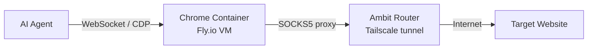

# Chromatic

## What Chromatic Is

Chromatic gives an AI agent a browser. It deploys headless Chrome instances in the cloud, on the user's private Ambit network, that an agent can control via the Chrome DevTools Protocol (CDP). The browser runs in a disposable container with no access to the user's local files or sessions, and it is only reachable over Tailscale — never exposed to the public internet.

Browsers sleep when idle and wake in a couple of seconds when the agent makes a request, so the user only pays for the seconds the browser is actually running. Typical developer usage comes to around $2.50 a month.

## How It Works



Chromatic deploys Chrome containers on Fly.io with private-only networking. The agent connects over WebSocket using the CDP protocol. Outbound traffic from the browser goes through the Ambit router's SOCKS5 proxy. The user's Tailscale network provides the secure tunnel between the agent and the browser.

## Prerequisites

- An Ambit network already set up with `ambit create <network>`
- `flyctl` installed and authenticated (`fly auth login`)
- Tailscale installed and connected

## Commands

### `chromatic setup`

One-time initialization. Discovers existing Ambit routers on the user's Fly.io organization and saves the network preference so subsequent commands know which network to use. The Ambit router must already be deployed before running this.

```bash
chromatic setup
chromatic setup --network lab --org my-org
```

**Flags:**
- `--network <name>` — Network to use (auto-detected if only one router exists)
- `--org <org>` — Fly.io organization slug
- `-y, --yes` — Skip confirmation prompts
- `--json` — Machine-readable JSON output

### `chromatic create <name>`

Deploys a new browser instance or browser pool onto the private network. A single browser (count 1) gives a direct CDP connection for stateful sessions. A pool (count > 1) load-balances connections across multiple Chrome instances for parallel stateless workloads like scraping.

```bash
chromatic create my-browser
chromatic create scrapers --count 5 --size shared-cpu-2x
chromatic create heavy --count 3 --size shared-cpu-4x --region sea
```

**Flags:**
- `--count <n>` — Number of machines (1–10, default: 1)
- `--size <size>` — Machine size (default: `shared-cpu-1x`)
- `--region <region>` — Fly.io region (default: `iad`)
- `--network <name>` — Network name (default: from setup config)
- `--org <org>` — Fly.io organization slug
- `--json` — JSON output

**Available sizes:**

| Size | CPU | RAM |
|------|-----|-----|
| `shared-cpu-1x` | 1 vCPU | 1 GB |
| `shared-cpu-2x` | 2 vCPU | 2 GB |
| `shared-cpu-4x` | 4 vCPU | 4 GB |

**What it does:**
1. Creates a Fly.io app on the private network
2. Sets the SOCKS5 proxy secret (for outbound traffic through the Ambit router)
3. Deploys the Chrome CDP container
4. Creates additional machines if `--count > 1`
5. Returns the WebSocket endpoint for connecting

### `chromatic mcp <name>`

Writes the browser's CDP endpoint into `.mcp.json` so an AI agent picks it up automatically. Uses the Playwright MCP server (`@playwright/mcp`) under the hood. Searches parent directories for an existing `.mcp.json`; use `--create` if one doesn't exist yet.

```bash
chromatic mcp my-browser
chromatic mcp my-browser --create
chromatic mcp my-browser --name my-custom-name --dry-run
```

**Flags:**
- `--name <server>` — Name for the MCP server entry (default: `chromatic-<name>`)
- `--create` — Create a new `.mcp.json` in the current directory if none is found
- `--dry-run` — Preview changes without writing
- `--network <name>` — Network name (default: from setup config)
- `--org <org>` — Fly.io organization slug
- `-y, --yes` — Skip confirmation prompts

**Generated config:**
```json
{
  "mcpServers": {
    "chromatic-my-browser": {
      "command": "npx",
      "args": [
        "@playwright/mcp@latest",
        "--cdp-endpoint",
        "ws://chromatic-cdp-my-browser-a1b2.lab:9222"
      ]
    }
  }
}
```

### `chromatic list`

Lists all browser instances on the network with their names, machine counts, and current state.

```bash
chromatic list
chromatic list --json
```

### `chromatic status <name>`

Shows detailed information for a browser instance, including each machine's ID, state, region, private IP, and WebSocket endpoint.

```bash
chromatic status my-browser
chromatic status my-browser --json
```

### `chromatic scale <name>`

Adds or removes machines in a browser pool. Scaling is declarative — you specify the desired total count, and chromatic calculates the diff. Supports mixed-size pools.

```bash
chromatic scale scrapers 5
chromatic scale scrapers --shared-cpu-1x 3 --shared-cpu-2x 2
```

**Flags:**
- `--shared-cpu-1x <n>` — Number of 1x machines
- `--shared-cpu-2x <n>` — Number of 2x machines
- `--shared-cpu-4x <n>` — Number of 4x machines
- `--region <region>` — Region for new machines (default: `iad`)
- `-y, --yes` — Skip confirmation prompts

### `chromatic doctor`

Health check for the local environment, router, and browser infrastructure. Run this whenever something seems broken.

```bash
chromatic doctor
chromatic doctor --network lab
```

**Checks:**
- Tailscale CLI installed and connected
- Accept-routes enabled
- Ambit router exists and is running
- Router visible in tailnet
- CDP browsers on network are reachable

### `chromatic destroy <name>`

Permanently deletes a browser instance and all its machines. Cannot be undone.

```bash
chromatic destroy my-browser
chromatic destroy my-browser --force
```

**Flags:**
- `-f, --force` — Destroy without confirmation
- `-y, --yes` — Skip confirmation (same as force)
- `--network <name>` — Network name
- `--org <org>` — Fly.io organization slug
- `--json` — JSON output

## Key Concepts

### Single Browser vs. Pool

- **Single browser** (`--count 1`, the default): One Chrome instance with a direct WebSocket connection. Use this for stateful sessions where the agent needs to maintain page state across multiple actions.
- **Pool** (`--count > 1`): Multiple Chrome instances behind Flycast load balancing. Each new WebSocket connection may land on a different machine. Use this for parallel stateless workloads like scraping multiple pages at once.

### Autostop

Machines automatically stop after 300 seconds (5 minutes) of inactivity to save costs. They wake in a couple of seconds when the agent connects again. This means the user is only billed for the time the browser is actively being used.

### Connection Endpoint

The WebSocket endpoint follows this format:
```
ws://chromatic-cdp-<name>-<suffix>.<network>:9222
```

This address only resolves from devices on the user's Tailscale network.

### Outbound Traffic

Chrome's outbound traffic goes through the Ambit router's SOCKS5 proxy. This means the browser can access the public internet (to visit websites), but the browser itself is never directly reachable from the public internet.

## Common Workflows

### First-Time Setup
```bash
# Prerequisites: ambit network already created
chromatic setup
chromatic create my-browser
chromatic mcp my-browser --create
# Agent can now use the browser
```

### Scale Up for Parallel Work
```bash
chromatic create scrapers --count 3
# Later, need more capacity:
chromatic scale scrapers 6
```

### Debugging
```bash
chromatic doctor                    # Check all common failure points
chromatic status my-browser         # Detailed machine state
```

### Tear Down
```bash
chromatic destroy my-browser
```

## Troubleshooting

| Symptom | Fix |
|---------|-----|
| "No routers found" during setup | Run `ambit create <network>` first to deploy a router |
| Browser not reachable after create | Run `chromatic doctor`. Check that accept-routes is enabled locally |
| Agent can't connect to CDP endpoint | Verify the `.mcp.json` endpoint matches `chromatic status <name>` output |
| Browser can't load external pages | Check the Ambit router is running — outbound traffic goes through its SOCKS5 proxy |
| "Flyctl not found" | Install from https://fly.io/docs/flyctl/install/ |

## Configuration

Chromatic stores its config at `~/.config/chromatic/config.json`:

```json
{
  "network": "browsers",
  "defaults": {
    "autoStopSeconds": 300,
    "machineSize": "shared-cpu-1x",
    "memoryMb": 1024
  }
}
```
